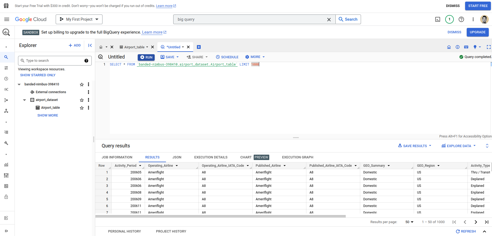

# Data Fetching to Landing to GCP Big Query



# CSV to BigQuery Loader

This Python script fetches CSV data from a URL and loads it into a specified Google BigQuery table.

## Usage

1. **Clone the Repository:**

   ```bash
   git clone https://github.com/yourusername/your-repo.git
   cd your-repo
   ```

2. **Set Up Google Cloud Credentials:**

   Follow the [official guide](https://cloud.google.com/docs/authentication/getting-started) to set up Application Default Credentials (ADC).

3. **Adjust Table ID:**

   Open `main.py` and ensure that `table_id` is set correctly to `project_id.dataset_id.table_id`.

4. **Run the Script:**

   Execute the Python script:

   ```bash
   python main.py
   ```

   This will fetch the CSV data, detect the schema, and load it into the specified BigQuery table.

## Configuration

- `csv_url`: URL of the CSV file to be loaded into BigQuery.
- `table_id`: ID of the BigQuery table in the format `project_id.dataset_id.table_id`.

## Troubleshooting

If you encounter any issues, refer to the [official documentation](https://cloud.google.com/docs/authentication/getting-started) on setting up Application Default Credentials.

---

Please replace placeholders like `yourusername/your-repo.git` and `project_id.dataset_id.table_id` with your actual information. This simplified README provides the essential steps to get the script up and running.